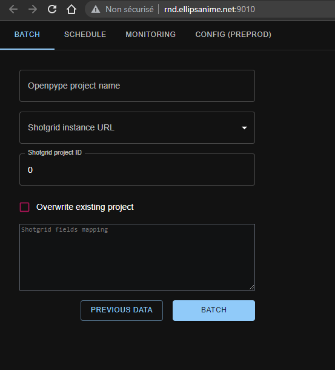
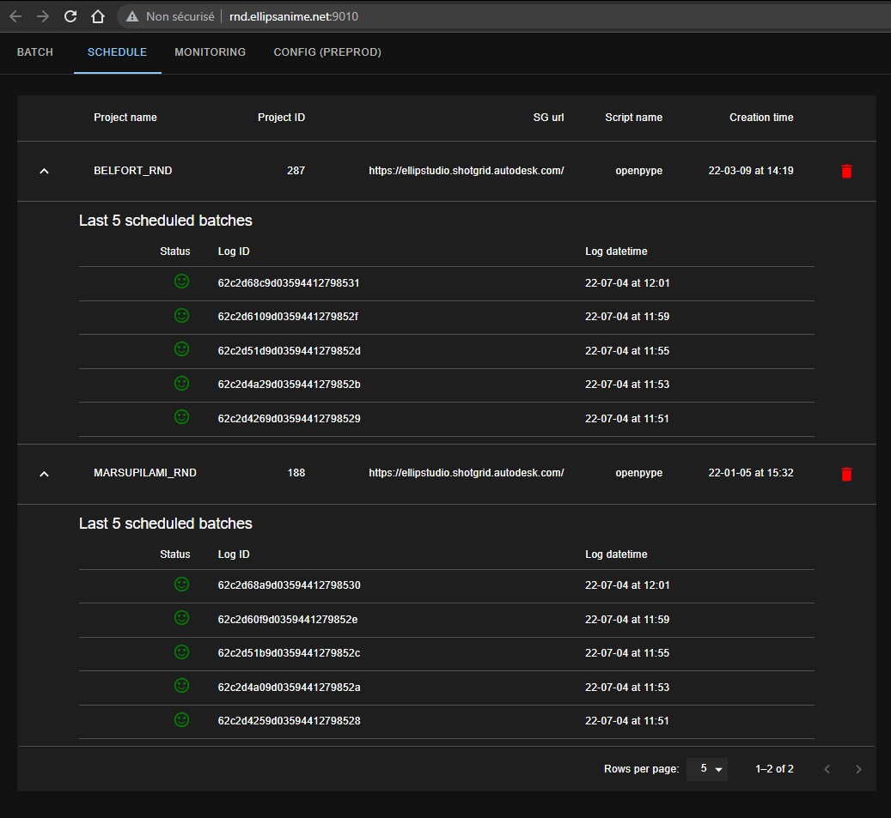
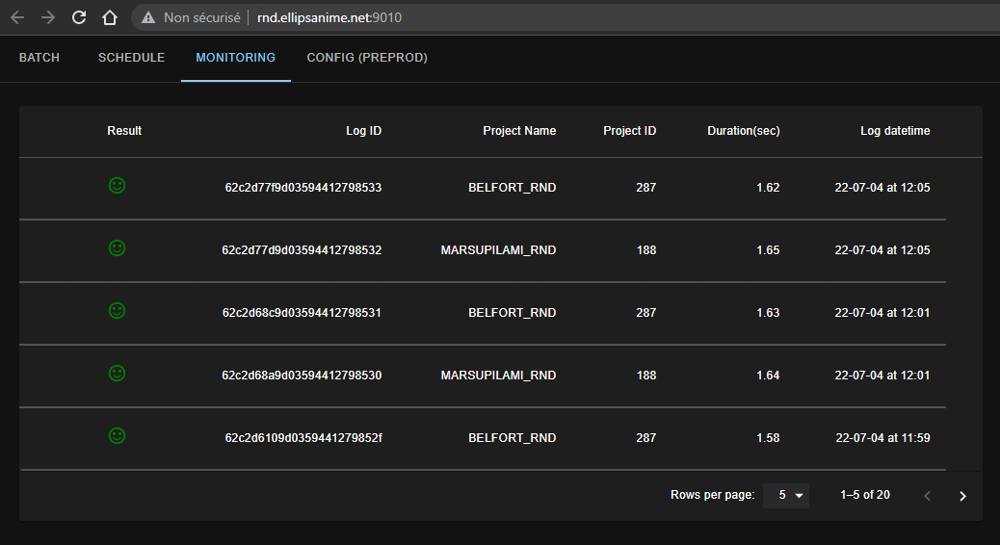
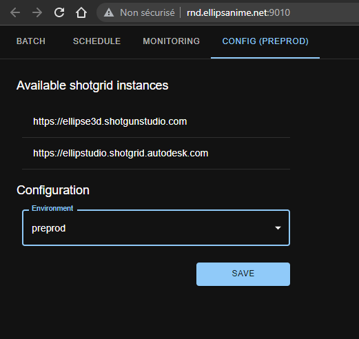

# Shotgrid Leecher App (Web UI)

Shotgrid Leecher UI is implemented as a [React App](https://github.com/facebook/create-react-app).

Let’s assume we're working version `0.1.1` of Shotgrid Leecher (see [Shotgrid Leecher API](https://github.com/Ellipsanime/shotgrid-leecher/blob/0.1.0/api/README.md) for more information on the backend part)

Switch to the `app` project folder: 

```bash
cd shotgrid-leecher/app
```

Get the right branch:

```bash
git pull --rebase
git checkout 0.1.1
```

Build docker image: 

```bash
docker build . -t leecher-app --no-cache
```

Tag built image and make it ready for AWS registry upload:

```bash
docker tag leecher-app:latest \
  <AWS-account-id>.dkr.ecr.<AWS-region>.amazonaws.com/ellipse/swarm_registry:shotgrid_leecher_app_v0.1.1
```

Login into AWS ECR (AWS private Docker registry):

```bash
aws ecr get-login-password \
  --region <AWS-region> | docker login \
  --username AWS --password-stdin [<AWS-account-id>.dkr.ecr.<AWS-region>.amazonaws.com](http://<AWS-account-id>.dkr.ecr.<AWS-region>.amazonaws.com/)
```

The result of login must be as following:

```bash
WARNING! Your password will be stored unencrypted in /home/ellipse/.docker/config.json.
Configure a credential helper to remove this warning. See
https://docs.docker.com/engine/reference/commandline/login/#credentials-store

Login Succeeded
```

Push built image into the AWS ECR:

```bash
docker push \
  [<AWS-account-id>.dkr.ecr.<AWS-region>.amazonaws.com/ellipse/swarm_registry:shotgrid_leecher_api_v0.1.](http://<AWS-account-id>.dkr.ecr.<AWS-region>.amazonaws.com/ellipse/swarm_registry:shotgrid_leecher_app_v0.1.0)1
```

For `app` **deployment**, you need to update `docker-compose.local.yml`

```yaml
version: "3.8"
services:
  leecher:
    image: '<AWS-account-id>.dkr.ecr.<AWS-region>.amazonaws.com/ellipse/swarm_registry:shotgrid_leecher_app_**v0.1.1**'
    environment:
      API_URI: ${API_URI}
    ports:
      - "9010:80"
      - "443:80"
    deploy:
      placement:
        constraints: [node.hostname == swarm-worker2]
      mode: 'replicated'
      replicas: 1
    dns:
      - 8.8.8.8
      - 9.9.9.9
```

Next step deploys `app` service to the Docker swarm:

```bash
env $(cat .env | grep "^[A-Z]" | xargs) docker stack deploy \
   --compose-file docker-compose.local.yml **shotgrid-leecher-app-prod** \
   --with-registry-auth
```

In order to check the status of newly deployed stack, you need to run the following command:

```bash
docker stack ls
```

The output should display stacks with related services

```bash
NAME                           SERVICES   ORCHESTRATOR
mongo_db_prod                  2          Swarm
shotgrid-leecher-api-preprod   1          Swarm
**shotgrid-leecher-app-prod      1**          Swarm
shotgrid-leecher-prod          1          Swarm
shotgrid-memcache-prod         1          Swarm
```

The state of each service can be displayed with `docker service ls`

```bash
ID             NAME                                   MODE         REPLICAS   IMAGE                                                                                             PORTS
jjmb86thh050   mongo_db_prod_mongo1                   replicated   1/1        mongo:5.0.4                                                                                       *:27053->27017/tcp
mdft5ekx2vxp   mongo_db_prod_mongo2                   replicated   1/1        mongo:5.0.4                                                                                       *:27054->27017/tcp
kvu934pkggjv   shotgrid-leecher-api-preprod_leecher   replicated   1/1        <AWS-account-id>.dkr.ecr.<AWS-region>.amazonaws.com/ellipse/swarm_registry:shotgrid_leecher_api_v0.1.0   *:8999->8080/tcp
9p9bcv3tobgv   **shotgrid-leecher-app-prod_leecher      replicated   1/1**        <AWS-account-id>.dkr.ecr.<AWS-region>.amazonaws.com/ellipse/swarm_registry:shotgrid_leecher_app_v0.1.0   *:443->80/tcp, *:9010->80/tcp
e8cwugiqyl38   shotgrid-leecher-prod_leecher          replicated   1/1        <AWS-account-id>.dkr.ecr.<AWS-region>.amazonaws.com/ellipse/swarm_registry:shotgrid_leecher_api_v0.1.0   *:8090->8080/tcp
```

You need to pay attention to `REPLICAS` number, it must always be `1/1` for leecher app service


### Clean up

Don’t forget to tidy up after building

```bash
docker system prune -a --volumes
```


## ShotGrid Leecher User Interface 

Once up and running, Shotgrid Leecher App is available on port 9010 at [http://<API_URI>:9010/](http://<API_URI>:9010/) 

### Launch a specific synchronization
 
 

### Display previous scheduled batches by project

 

### Display previous scheduled batches chronologically

 

### Select Environment (Preproduction / Production)

 